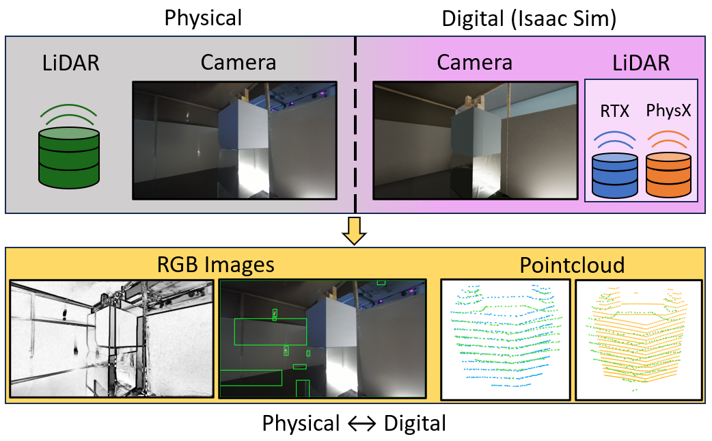

# Cubetower-DT


## Overview
### Generating Synthetic Data from Real-world Scenarios with NVIDIA's Omniverse Isaac Sim
This project provides the means to generate synthetic data from a recreated virtual environment using [NVIDIA's Omniverse Isaac Sim](https://developer.nvidia.com/isaac/sim). Scene, sensor, and trajectory files are already included to synthesize camera and LiDAR data from a cube-tower setup, which was created as a digital twin of a real cube-tower scenario. Developed as part of my undergraduate thesis at [RPTU Kaiserslautern](https://rptu.de/en) and during my time as an undergraduate software developer at [SmartFactory KL](https://smartfactory.de/), it was supported through close exchange with members of the [NVIDIA Omniverse](https://www.nvidia.com/en-us/omniverse/) team. A key goal was to evaluate the accuracy of digital sensors, with a particular focus on comparing the RTX and PhysX LiDAR sensor implementations to real-world sensor behavior in the corresponding physical scene.

The project is designed to enable the generation of synthetic data for any given scenario. By modifying the USD scene and robot stage, along with the camera or LiDAR specifications, users can simulate a wide range of environments within Isaac Sim.  
Furthermore, by integrating custom trajectory and sensor timestamp data, whether collected from real-world scans or created from scratch, users can define and interpolate their own paths for data synthesis and evaluation.


## Setup
### Prerequisites
* [Omniverse Isaac Sim 2022.2.1](https://docs.omniverse.nvidia.com/app_isaacsim/app_isaacsim/install_workstation.html)
* [ROS 2](https://docs.ros.org/en/foxy/Installation/Alternatives/Ubuntu-Development-Setup.html) and [cv_bridge](https://github.com/ros-perception/vision_opencv/tree/rolling/cv_bridge) (works only on Linux and is only required if extracting and parsing data of ros bags is needed, see instructions bellow)

### Clone repository
* Linux
```
cd ~
git clone https://github.com/patrickbail/cubetower-dt.git
```
* Windows
```
cd %USERPROFILE%
git clone https://github.com/patrickbail/cubetower-dt.git
``` 
## Further instructions
1. See [Virtual Lab Run](virtual_lab_run.md) for instructions on how to simulate a real-world scenario and how to generate synthetic data
2. See [Extratcing Data](extracting_data.md) for instructions on how to build ROS2 Foxy on your system and how to extract recorded data
3. See [Run Standalone](run_standalone.md) for instructions on how to run and work on standalone Isaac Sim python scripts
